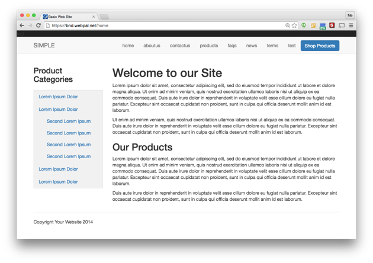
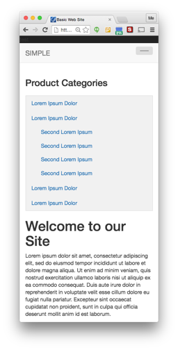

Simple Bootstrap Theme
======================

This is a **very** basic site theme, useful for getting started from a 'blank slate'.

Use this theme as an extension to your [WebPal](https://webpal.net) site.

Some attributes:

- Bootstrap 3
- Single-column layout
- CSS and JS are sourced at various CDNs, thus the pages load very fast
- basic use of navigation templates
- dynamic rendering of Copyright dates

